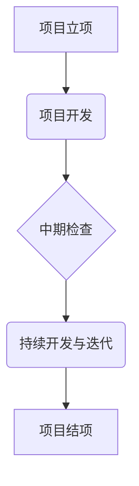

# 项目管理与关键节点指南

## 1. 引言

本指南旨在帮助学生团队高效、规范地管理科创项目，确保从项目启动到最终交付的整个过程清晰、可控。成功的项目不仅在于“做什么”（What），更在于明确“怎么做”（How）。我们强调在项目启动阶段就必须制定详尽的执行路线图，为项目的顺利推进奠定坚实基础。

---

## 2. 项目生命周期与关键节点

一个完整的项目通常经历以下三个关键节点：**项目立项**、**中期检查**和**项目结项**。每个节点都有明确的目标和需要产出的交付物。

### 节点一：项目立项 (Project Kickoff)

**目标：** 在此阶段，团队需要将初步想法（Idea）转化为一份完整、可执行的计划。立项的重点是深入思考项目的可行性、创新性，并规划出清晰的技术实现路径。

**核心产出物：** 《项目立项报告》

**《项目立项报告》应包含以下核心内容：**

1.  **项目概述 (Project Overview)**
    *   **项目背景：** 要解决什么问题？为什么这个问题值得解决？
    *   **项目目标：** 希望通过项目达成什么具体、可衡量的成果？(e.g., 开发一个能识别10种手势的体感应用)
    *   **用户画像：** 谁是你的目标用户？他们有什么特点？

2.  **关键创新点 (Key Innovations)**
    *   明确列出项目的1-3个核心创新之处。
    *   这些创新点可以是技术上的、设计上的、或是应用场景上的。
    *   **示例：**
        *   *技术创新：* 采用一种新颖的轻量级神经网络模型，在保证识别率的同时，将处理延迟降低50%。
        *   *应用创新：* 将体感交互技术应用于古诗词学习，创造沉浸式学习体验。

3.  **技术路线 (Technical Roadmap)**
    *   **系统架构图：** 绘制高层级的系统架构图，展示各个模块（如前端、后端、数据库、算法模型）之间的关系。
    *   **技术选型：** 明确项目将使用的主要技术栈（编程语言、框架、库等），并简述选择原因。
    *   **核心功能实现方案：** 针对项目的关键功能，阐述具体的技术实现思路。例如，如何进行数据采集、模型训练、API设计等。

4.  **实施计划 (Implementation Plan)**
    *   **任务分解 (WBS)：** 将项目分解为多个可管理的主要任务模块。
    *   **时间规划 (Timeline)：** 制定项目时间表（甘特图），明确每个任务的起止时间、负责人和关键里程碑。
    *   **团队分工 (Roles & Responsibilities)：** 明确每个团队成员的角色和具体职责。

5.  **预期成果 (Expected Outcomes)**
    *   列出项目完成时需要交付的全部内容。
    *   **示例：**
        *   可正常运行的Web应用或App安装包
        *   项目源代码及部署说明
        *   项目演示视频
        *   结项报告和答辩PPT

---

### 节点二：中期检查 (Mid-term Review)

**目标：** 评估项目进展，与初期计划进行对比，及时发现并解决问题，调整后续开发方向。

**核心产出物：** 《中期进展报告》与阶段性成果演示 (Live Demo)

**报告与演示应覆盖以下要点：**

1.  **进度回顾：** 对比甘特图，展示已完成和未完成的任务。
2.  **成果演示：** 动态演示当前已实现的核心功能。
3.  **问题与挑战：** 总结开发过程中遇到的主要技术难题、团队协作问题等，并说明已采取或计划采取的解决方案。
4.  **计划调整：** 根据实际情况，对后续的技术路线、任务优先级或时间规划进行必要的调整。

---

### 节点三：项目结项 (Final Review)

**目标：** 全面展示项目最终成果，总结项目经验，完成项目交付。

**核心产出物：** 最终交付物（软件、代码、文档等）与《项目结项报告》

**《项目结项报告》应包含：**

1.  **项目成果总结：** 概述项目目标的完成情况，展示最终产品的核心功能与亮点。
2.  **技术实现总结：** 详细介绍最终的系统架构、核心算法、技术实现细节以及遇到的挑战与解决方案。
3.  **创新点复盘：** 回顾立项时提出的关键创新点，并阐述其最终实现情况。
4.  **项目反思与展望：** 总结项目管理、技术开发和团队协作方面的经验教训，并对项目的未来发展或改进方向提出展望。
