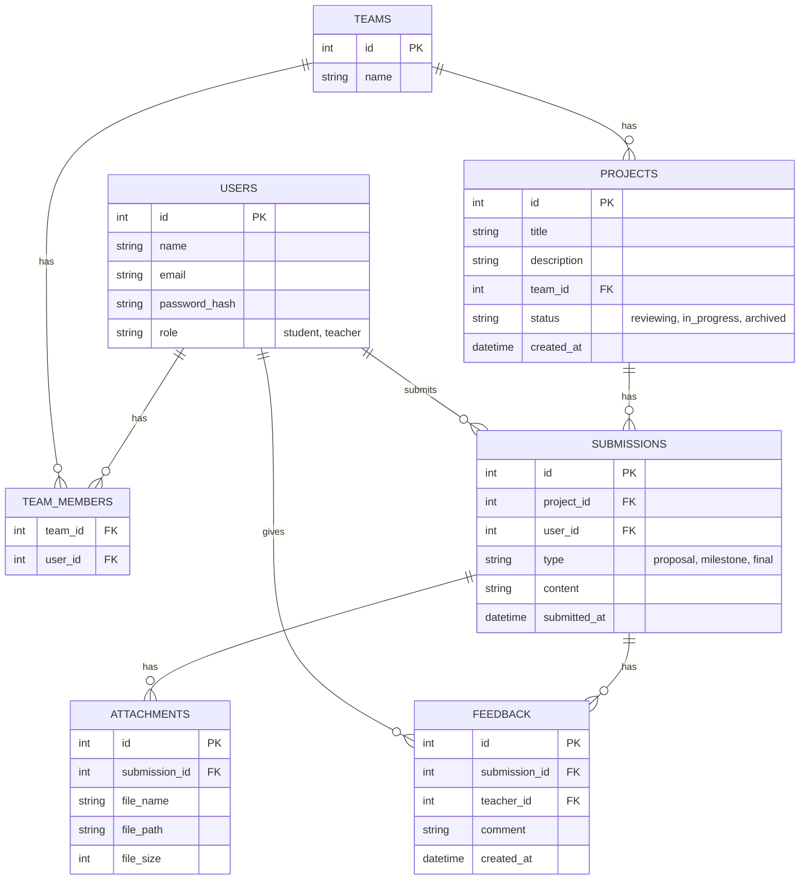

# 2. 技术架构 (Technical Architecture)

**版本**: v1.0
**状态**: 规划中

## 1. 总体架构

平台采用前后端分离的架构。前端负责用户交互与视图展示，后端提供业务逻辑和数据 API。Gitea 作为独立的 Git 服务，通过 API 与主平台集成。

```mermaid
graph TD
    subgraph 用户端
        A[浏览器]
    end

    subgraph 平台前端 (SPA)
        B[表示层: React/Vue]
        C[状态管理: Redux/Pinia]
        D[API请求: Axios/Fetch]
    end

    subgraph 平台后端 (Node.js)
        E[Web框架: Fastify]
        F[认证: JWT/OAuth2]
        G[ORM: Prisma/Sequelize]
        H[数据库: SQLite/PostgreSQL]
        I[文件存储: 本地磁盘]
    end

    subgraph 外部服务
        J[代码仓库: Gitea]
    end

    A --> B
    B --> C
    C --> D
    D -- HTTP/HTTPS --> E
    E --> F
    E --> G
    G --> H
    E --> I
    E -- Gitea API --> J
```

---

## 2. 技术选型 (Tech Stack)

| 领域 | 技术 | 备注 |
|---|---|---|
| **前端** | React / Vue.js | 建议使用现代框架构建 SPA，以提升交互体验。 |
| **CSS** | Tailwind CSS | 沿用现有技术栈，统一风格。 |
| **后端** | Node.js + Fastify | 沿用现有技术栈，轻量高效。 |
| **数据库** | **SQLite** (初期) -> **PostgreSQL** (后期) | SQLite 便于快速启动和本地部署，PostgreSQL 支持更复杂查询和扩展。 |
| **代码托管** | Gitea | 已集成，未来需通过 API 深度整合。 |

---

## 3. API 接口规范 (V1)

所有 API 以 `/api/v1` 为前缀。

### 项目 (Projects)
- `POST /projects` - 创建新项目（提交开题报告）
- `GET /projects` - 获取项目列表（支持教师/学生筛选）
- `GET /projects/:id` - 获取单个项目详情
- `PUT /projects/:id/status` - 更新项目状态（教师用，如：审核通过/驳回）

### 提交 (Submissions)
- `POST /projects/:id/submissions` - 提交新的里程碑/结题成果
- `GET /projects/:id/submissions` - 获取某项目的所有提交记录

### 反馈 (Feedback)
- `POST /submissions/:id/feedback` - 对某次提交添加反馈（教师用）

### 用户 (Users)
- `POST /auth/register` - 用户注册
- `POST /auth/login` - 用户登录
- `GET /auth/me` - 获取当前用户信息

---

## 4. 数据模型 (Data Model)



---

## 5. 架构改进点 (Architectural Improvement Areas)

- **认证与授权**: 当前后端完全开放，必须优先实现用户认证，并对 API 进行权限控制（例如，只有教师才能更新项目状态）。
- **输入验证**: 所有 API 的输入参数都需要进行严格的验证、清理和转换，以防止注入等安全问题。
- **文件管理**:
    - 文件上传功能需要健壮的实现，包括大小限制、类型验证。
    - 大文件下载应支持断点续传和进度显示。
- **性能**: 对于高频读操作（如获取项目列表），应引入缓存机制（如 Redis）。
- **日志与监控**: 添加结构化的日志系统，记录关键操作和错误，并建立基本的健康检查端点。
- **部署**: 需要标准化的容器化部署方案（如 Docker），并配置 HTTPS。
